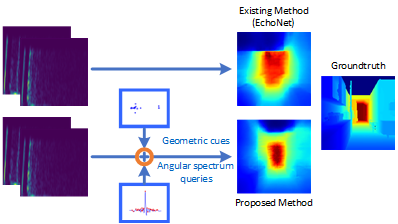

# SAGENet

This repository contains the codebase for "SAGENet: Binaural Echo-Based 3D Depth Estimation with Sparse Angular Queries and Refined Geometric Cues" (IROS 2025).

  

## File Structure

    SAGENet/
    ├── config/
    │   └── config.yaml          # Configuration file
    ├── data_loader/
    │   └── custom_dataset_data_loader.py  # Data loader
    ├── models/
    │   ├── audioVisual_model.py  # Audio-visual model
    │   ├── models.py             # Model builder
    │   └── PointNet.py           # PointNet model
    ├── utils/
    │   └── Opt_.py               # Configuration options parser
    ├── train.py                  # Training script
    ├── inference_visualize.py    # Inference and visualization script
    ├── GCC_PCL.py                # GCC-PCL algorithm implementation
    ├── README.md                 # Project description file

## Usage

### Dataset

If you wish to validate using the cropped BatVision V1 dataset referenced in our paper, please follow the steps below.

1. First, download the complete [BatiVision](https://github.com/AmandineBtto/Batvision-Dataset.git) V1 dataset. Place Data_filter.py and Dataset_check.py into the dataset directory, and run Dataset_check.py to verify the integrity of the downloaded data.
2. Next, execute Data_filter.py to generate the filtered dataset.
3. Finally, modify the dataset path at line 62 of data_loader/BatvisionV1_Dataset.py, and update the dataset type in config/config.yaml accordingly.

If you wish to perform validation using the Replica dataset, please first download the complete dataset by following the instructions provided in VisualEchoes.

    wget http://dl.fbaipublicfiles.com/VisualEchoes/rgb_depth/scene_observations_128.pkl
    wget http://dl.fbaipublicfiles.com/VisualEchoes/echoes_navigable.tar.gz

Next, extract the downloaded dataset and place it into the dataset directory.

### Train the Model

Run the [train.py](http://_vscodecontentref_/3) file to train the model:

    python train.py

### Visualization

Run the following command in the terminal to visualize the model's depth estimation results for a specific scene.

    python inference_visualize.py

## Acknowledgement

The code of this project is built upon the framework of [Beyond Image to Depth: Improving Depth Prediction using Echoes](https://github.com/krantiparida/beyond-image-to-depth.git). We gratefully acknowledge the open-source code provided by Parida, as well as the datasets contributed by [BatiVision](https://github.com/AmandineBtto/Batvision-Dataset.git) and [VisualEchoes](https://github.com/facebookresearch/VisualEchoes.git).

